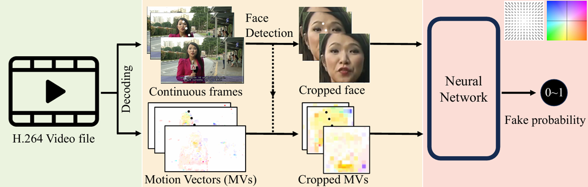

# DeepFake Detection

This repository contains a University project for the course **Signal, Image and Video Processing**.  

I decided to implement a [paper](https://arxiv.org/abs/2311.10788) where I could code a full ML pipeline for video processing using `opencv`, `ffmpeg` and `Pytorch`.

---

## About the Project
The implementation is based on the paper:

> *Efficient Temporally-Aware DeepFake Detection using H.264 Motion Vectors* 

The core idea is to detect DeepFakes using **H.264 motion vectors (MVs)** instead of **optical flow**.  
While optical flow is more precise, it is also computationally expensive. Motion vectors, being a byproduct of H.264 encoding, are extremely efficient to compute, making this approach suitable for **embedded systems with limited computational resources**.

---

## Dataset
We use a subset of **400 videos** from the [FaceForensics++ dataset](https://www.kaggle.com/datasets/hungle3401/faceforensics?resource=download).  

The dataset is split into `real/` and `fake/` directories (200 videos each). Each video is processed to extract both:
- **Cropped face frames** (via YuNet detector, resized to 224x224).
- **Motion vectors (MVs) and Information Masks (IMs)** from H.264 streams.

---

## Pipeline

1. **Dataset Setup**  
   Videos are organized into `real/` and `fake/` and preprocessed by extracting fraces from 100 random samples in the video and extracting the motion vectors from the extracted crops. 

2. **Face Detection**  
   Using **YuNet**, the largest face per frame is cropped and resized to 224×224. The paper suggests to use MTCNN but I decided to use YuNet since it's lighter and optimized for CPU. 

3. **Motion Vector Extraction**  
   With **PyAV**, block-level motion vectors (16×16 macroblocks) and Information Masks are extracted from H.264 encoded videos.

4. **Feature Computation**  
   MV + IM features are normalized and stored along with the cropped face images.

5. **Classification**  
   A **two-stream MobileNetV3-based architecture** is trained:
   - One branch for RGB face frames.  
   - One branch for motion vectors (MV + IM).  
   - Outputs are averaged to find the final prediction.

6. **Training Strategy**  
   Since I had really few videos for the training I divided the training into 2 phases:
   - **Phase 1 (first 5 epoches):** Backbone frozen, only classifier head is trained.  
   - **Phase 2:** Entire network is unfrozen and fine-tuned with a smaller learning rate.  
   - Augmentations include **color changes** and **horizontal flips** (as in the paper).

7. **Evaluation**  
   The model is evaluated with **accuracy, loss, confusion matrix**.

---

## Results
The resulting models achieves 64% accuracy, compared to 71% of the paper but using a dataset which is 20% of the original one. 

As found in the paper the bottleneck is the face extraction procedure, even using a lighter solution (YuNet) es extractor. 

For more details on the project check the [documentation file](https://github.com/pietroDeAngeli/DeepFake-Detection/blob/main/DeepFake_detection___documentation.pdf) or feel free to send me an email.  

---

## Requirements
- Python=3.10
- PyTorch  
- OpenCV (`cv2`)  
- PyAV  
- Albumentations  
- Matplotlib, Seaborn, Pandas